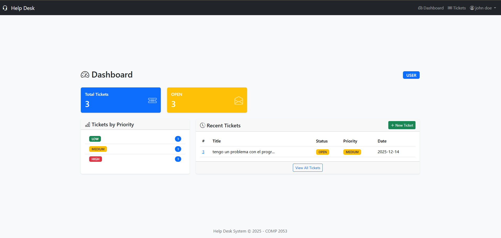

# Manual de Usuario - Sistema Help Desk

## Índice
1. [Introducción](#introducción)
2. [Inicio de Sesión](#inicio-de-sesión)
3. [Registro de Usuario](#registro-de-usuario)
4. [Dashboard](#dashboard)
5. [Gestión de Tickets](#gestión-de-tickets)
6. [Administración de Usuarios](#administración-de-usuarios)
7. [Roles y Permisos](#roles-y-permisos)

---

## Introducción

El Sistema Help Desk es una aplicación web diseñada para gestionar tickets de soporte técnico. Permite a los usuarios crear tickets, hacer seguimiento de sus solicitudes y comunicarse con el equipo de soporte.

---

## Inicio de Sesión

1. Acceda a la página principal del sistema
2. Ingrese su **correo electrónico** en el campo "Email"
3. Ingrese su **contraseña** en el campo "Password"
4. Haga clic en el botón **"Login"**

Si no tiene una cuenta, haga clic en "Register here" para crear una nueva cuenta.

---

## Registro de Usuario

1. En la página de login, haga clic en **"Register here"**
2. Complete los siguientes campos:
   - **Full Name**: Su nombre completo
   - **Email**: Su correo electrónico (único)
   - **Password**: Una contraseña segura (mínimo 6 caracteres)
   - **Confirm Password**: Repita la contraseña
3. Haga clic en **"Register"**
4. Una vez registrado, será redirigido a la página de login

**Nota**: Los nuevos usuarios registrados obtienen el rol "USER" por defecto.

---

## Dashboard

El Dashboard es la página principal después de iniciar sesión. Muestra:

### Estadísticas
- **Total Tickets**: Número total de tickets en el sistema
- **Total Users**: Número total de usuarios (solo visible para Admin)
- **Tickets por Estado**: OPEN, IN_PROGRESS, RESOLVED

### Tickets por Prioridad
- **HIGH**: Tickets de alta prioridad
- **MEDIUM**: Tickets de prioridad media
- **LOW**: Tickets de baja prioridad

### Tickets Recientes
Lista de los últimos 5 tickets (según su rol)

---

## Gestión de Tickets

### Ver Lista de Tickets

1. Haga clic en **"Tickets"** en el menú de navegación
2. Verá una tabla con todos los tickets (según su rol)

#### Filtros Disponibles:
- **Search**: Buscar por título o descripción
- **Status**: Filtrar por estado (OPEN, IN_PROGRESS, RESOLVED)
- **Priority**: Filtrar por prioridad (LOW, MEDIUM, HIGH)

### Crear Nuevo Ticket

1. Haga clic en el botón verde **"New Ticket"**
2. Complete el formulario:
   - **Title**: Título breve del problema (máx. 200 caracteres)
   - **Description**: Descripción detallada del problema
   - **Priority**: Seleccione la prioridad (LOW, MEDIUM, HIGH)
3. Haga clic en **"Create Ticket"**

### Ver Detalle del Ticket

1. En la lista de tickets, haga clic en el **número del ticket** o el **icono de ojo**
2. Podrá ver:
   - Información completa del ticket
   - Estado y prioridad actual
   - Historial de comentarios
   - Formulario para agregar comentarios

### Agregar Comentarios

1. En la página de detalle del ticket
2. Escriba su comentario en el área de texto
3. Haga clic en **"Add Comment"**
4. El comentario se agregará sin recargar la página (AJAX)

### Actualizar Ticket (Solo Admin/Agent)

1. En la página de detalle del ticket
2. Use el panel lateral derecho para:
   - Cambiar el **Status**
   - Cambiar la **Priority**
   - **Asignar** el ticket a un agente
3. Haga clic en **"Update Ticket"**

---

## Administración de Usuarios

**Solo disponible para usuarios con rol ADMIN**

### Ver Lista de Usuarios

1. Haga clic en **"Users"** en el menú de navegación
2. Verá una tabla con todos los usuarios del sistema

### Cambiar Rol de Usuario

1. En la lista de usuarios
2. Seleccione el nuevo rol del dropdown
3. Haga clic en el botón de **check**

### Eliminar Usuario

1. Haga clic en el botón **rojo (trash)**
2. Confirme la eliminación

**Nota**: No se pueden eliminar usuarios que tengan tickets creados.

---

## Roles y Permisos

### ADMIN (Administrador)
- ✅ Ver todos los tickets
- ✅ Crear tickets
- ✅ Actualizar cualquier ticket
- ✅ Agregar comentarios
- ✅ Gestionar usuarios
- ✅ Cambiar roles de usuarios

### AGENT (Agente de Soporte)
- ✅ Ver tickets asignados o sin asignar
- ✅ Crear tickets
- ✅ Actualizar tickets
- ✅ Agregar comentarios
- ❌ No puede gestionar usuarios

### USER (Usuario/Cliente)
- ✅ Ver solo sus propios tickets
- ✅ Crear tickets
- ✅ Agregar comentarios
- ❌ No puede actualizar estado de tickets
- ❌ No puede gestionar usuarios

---

## Cerrar Sesión

1. Haga clic en su nombre de usuario en la esquina superior derecha
2. Seleccione **"Logout"** del menú desplegable

---

## Soporte

Si tiene alguna pregunta o problema con el sistema, contacte al administrador del sistema.

---

*Help Desk System - COMP 2053 Final Project - 2025*
